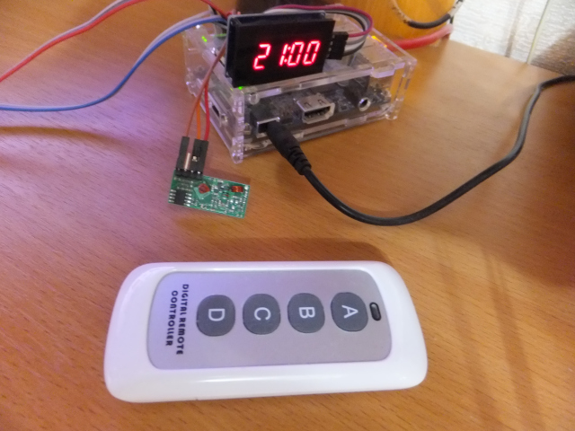

# gpiorcrecv-kmod

FreeBSD kernel module for GPIO remote control receiver



## About

The kernel driver reads a sequence of pulses from a remote control receiver
(e.g., mx-rm-5v) and tries to decode it into a number. This number can
be read from a character device or received by ioctl() as a control code.
The driver also generates `poll`(2) and `kqueue`(2) events informing the user process
about the presence of new code for it.
It is possible to read additional information about the code using a ioctl()
call (such as a timestamp. See `rcrecv.h` and `./bin/` folder for examples).

## Installation

You need the FreeBSD source codes for build the driver. You can copy it,
mount usb-flash with it or mount it as NFS share from another PC to
`/usr/src` as I did - It doesn't matter - all these methods will work fine.
Run this commands from driver directory:
```shell
make
sudo make install
```
Now You installed the driver You also need to define the receiver as a device.
You can do it either by FDT-overlay or by device.hints.

### FDT-overlay based setup

Go to `./fdt-overlay` folder and choose an example of `.dtso` overlay that
suits Your system best. Copy it to a name without `.sample` tail and edit it.
Lines You should pay attention to are:
```ini
compatible =
pins =
gpios =
```
Obviously You should to define the pin You connect Your receiver to. Also You
need to define a right compatible string (Simplest way to do it is take the
same one from Your other overlays).

To build and install Your new overlay run:
```shell
make
sudo make install
```
All You need now is to add a name of new fdt-blob to `/boot/loader.conf` for
autoload it when system is rebooted (An extension can be omitted):
```ini
fdt_overlays="your,other,overlays,sun8i-h3-rcrecv-gpio"
```

### device.hints based pin setup

For not DTS-compatible system You can setup the device by editing a file
`/boot/device.hints`. By example, for a device on pin 13:

```ini
hint.rcrecv.0.at="gpiobus0"
hint.rcrecv.0.compatible="rcrecv"
hint.rcrecv.0.pin_list="13"
### Optional. 60% is default tolerance value
hint.rcrecv.0.default-tolerance="60"
```

After changes are made You need to reboot Your system - `kenv` command
changes the variables ok but it seems they does not be honored on already
running system anyway.

## Status

Tested on `Orange PI PC` and `Orange PI Zero`.
Works like a charm for me.

## Thanks

Suat Özgür (aka sui77) for [rc-switch](https://github.com/sui77/rc-switch)
